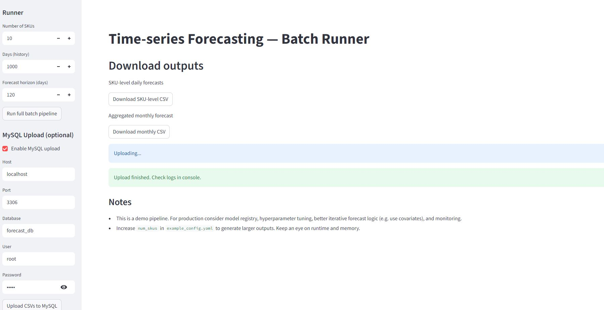
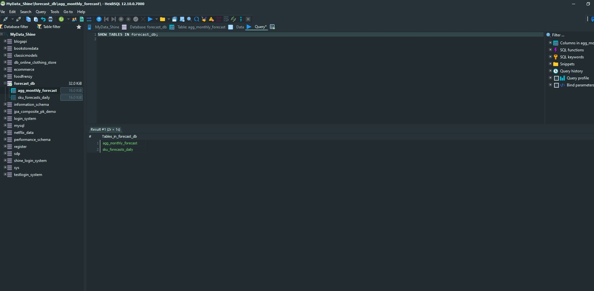
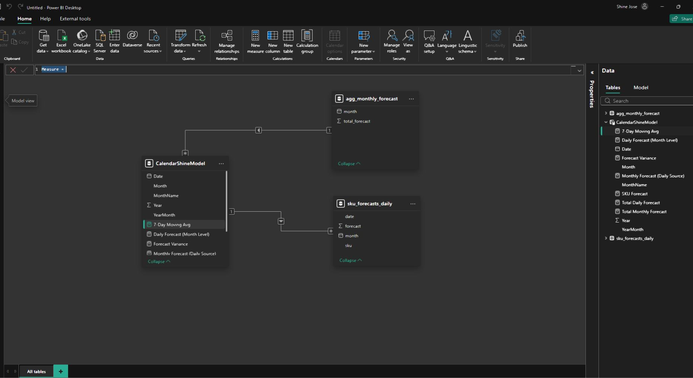
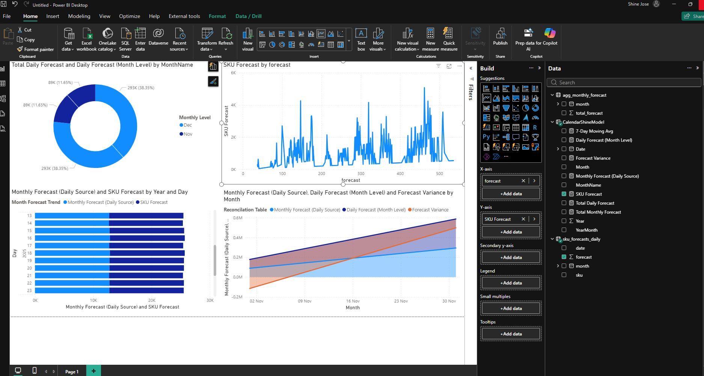

# Time-Series Forecasting

**Pharma / Chemical example**

[](https://www.python.org)
[](https://streamlit.io)

---

## Overview

A compact, end-to-end example pipeline for synthetic time-series generation, model training, batch forecasting, and Power BI visualization. It’s tailored for SKU-level demand forecasting (pharma/chemical), but is easily adaptable to other domains.

**What you get**

* Synthetic historical SKU-level daily data
* Model training and batch forecast scripts
* Outputs exported as CSVs (and example MySQL upload)
* Power BI instructions and Power Query snippets for fast visualization

---

## Repo structure

```
├── data/                       # raw and synthetic input files
│   └── synthetic_sku_daily.csv
├── outputs/                    # generated forecasts and aggregates
│   └── sku_forecasts_daily.csv
├── streamlit_app.py            # interactive UI to run the pipeline
├── data_generator.py           # generate synthetic time-series data
├── model_train.py              # train forecasting model(s)
├── batch_forecast.py           # run batch forecasts and write outputs
├── export_mysql.py             # example: push CSV outputs into MySQL (SQLAlchemy)
├── powerbi_instructions.md     # detailed Power BI steps & Power Query snippets
├── example_config.yaml         # config: num_skus, days, horizon, output sizes
└── requirements.txt
```

---

## Quick start

**1. Create and activate a Python environment**

```bash
python -m venv .venv
source .venv/bin/activate   # Windows: .venv\Scripts\activate
pip install -r requirements.txt
```

**2. Run the Streamlit app (recommended for interactive use)**

```bash
streamlit run streamlit_app.py
```

**3. Or run the pipeline scripts directly**

```bash
python data_generator.py
python model_train.py
python batch_forecast.py
```

By default the generator creates ~**50 SKUs × 3 years** daily (~54,000 rows). Adjust `example_config.yaml` to scale `num_skus`, `days`, and `forecast_horizon`.

---

## Configuration

Edit `example_config.yaml` to change:

* `num_skus` — number of unique SKUs to simulate
* `days` — historical days to generate
* `forecast_horizon` — days ahead to forecast
* `output` — filenames and aggregation settings

---

## Outputs

All CSV outputs land in the `outputs/` folder. Key files:

* `outputs/sku_forecasts_daily.csv` — daily forecast per SKU
* `outputs/agg_monthly_forecast.csv` — monthly aggregated forecasts (example)

---

## Power BI — usage guide (quick)

Two options: import CSVs or connect to MySQL.

### Option A — Import CSV / Excel

1. Power BI Desktop → **Get Data → Text/CSV** → `outputs/sku_forecasts_daily.csv`
2. In Power Query, set `date` column type to **Date**.
3. If using `data/synthetic_sku_daily.csv`, create relationship by `sku` + `date`.
4. Suggested visuals:

   * **Line chart**: X = `date`, Y = `forecast`, split by `sku` (small multiples or slicer)
   * **Matrix**: rows `sku`, columns `month`, values = SUM(`forecast`)
   * **Card / KPI**: monthly totals, YoY or MoM comparisons
5. Create `month` column in Power Query: `Date.StartOfMonth([date])`

### Option B — Connect to MySQL

1. Get Data → **MySQL database** (supply host, db, credentials).
2. Select tables: `sku_forecasts_daily`, `agg_monthly_forecast`.
3. Consider **DirectQuery** for near-real-time, but be mindful of performance.

### Power Query tips

* Pivot monthly data for heatmaps: Group by `sku` & `month` → Sum(`forecast`) → Pivot `month`.
* For very large datasets prefer aggregated tables (weekly/monthly) and push transformation to DB.

---

## Export to MySQL

See `export_mysql.py` for an example showing how to load CSVs into a MySQL table using SQLAlchemy. It’s a minimal example — adapt schema, batching, and credentials for production.

---

## Suggested Power BI layout

* **Page 1:** Overview — KPIs, totals, trend
* **Page 2:** SKU Explorer — slicer for SKU, actual vs forecast
* **Page 3:** Plant / Category analysis — breakdowns and bar charts

---

## Screenshots

Include the repository images in `docs/` or keep them at the repo root. Example placeholders:

<p align="center"></p>
<p align="center"></p>
<p align="center"></p>
<p align="center"></p>

---

## Contributing

Contributions welcome. Please open an issue for feature requests or bug reports, and follow these steps:

1. Fork the repo
2. Create a feature branch
3. Submit a pull request with a clear description

---

## License

This project is provided as-is for demo and learning purposes. 
---

## Author

**Shine Jose — M.Sc. Informatik (Data Science)**

